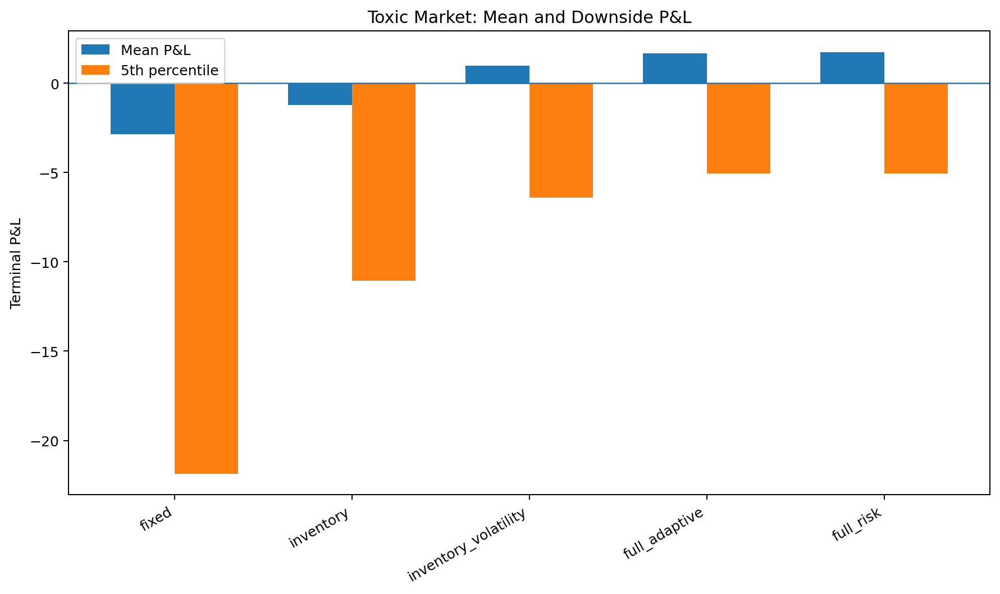
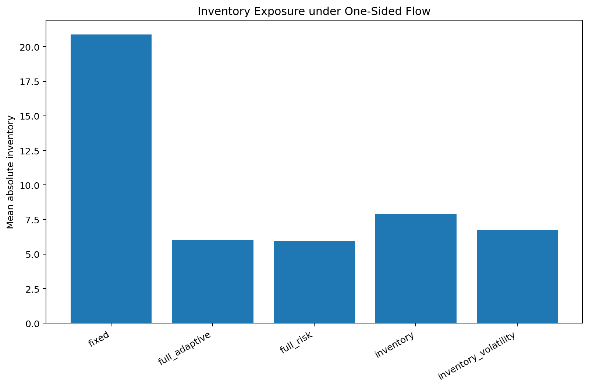
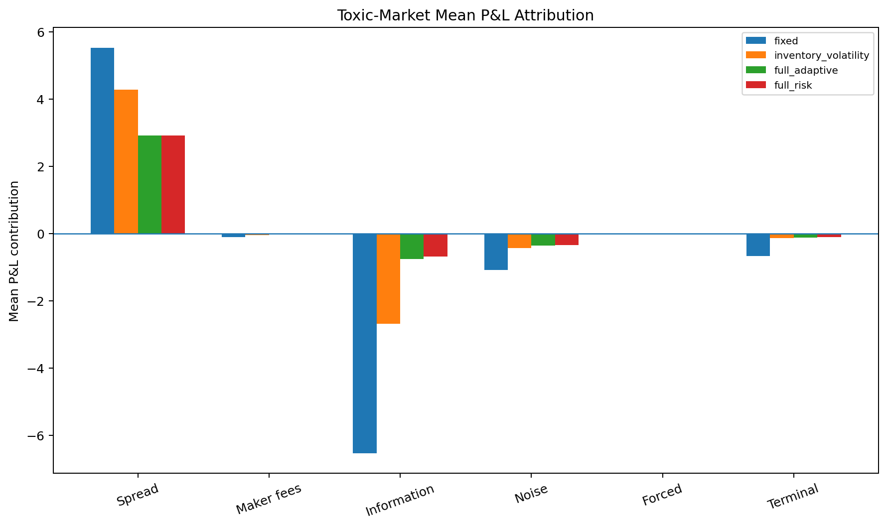
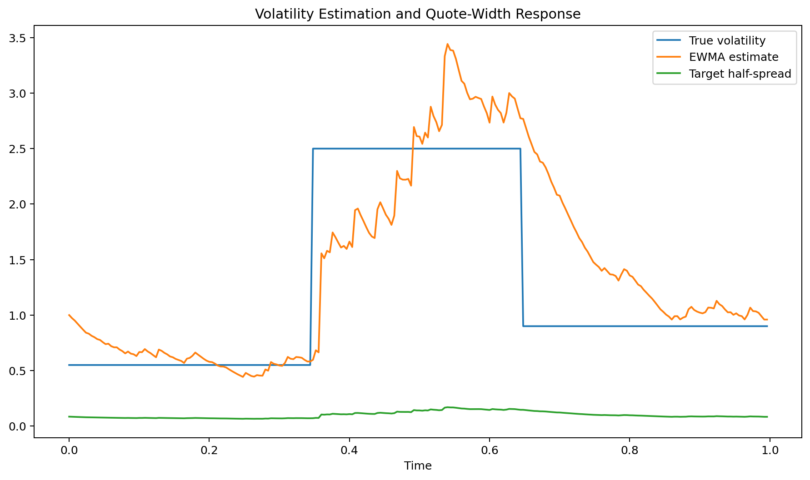
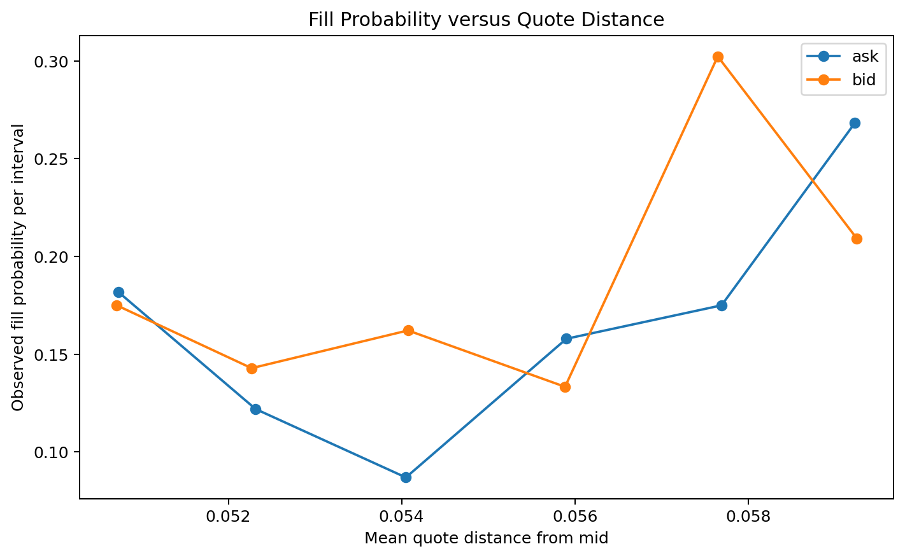

# Inventory-Aware Market-Making Simulator


I kept coming back to a simple contradiction in passive market making: a fill looks profitable at the instant it occurs, yet the position can lose money almost immediately if the market moves against it. I built this simulator to separate those two effects and to see how inventory, volatility, and adverse selection interact over the same price path.

The model begins with fixed two-sided quotes. I then add inventory skew, volatility-sensitive width, side-specific markout feedback, and an independent risk layer. Cash, inventory, fees, forced execution, and terminal liquidation are recorded explicitly because I wanted every terminal result to be traceable back to the ledger rather than explained only by a summary statistic.

> This is a stylized simulator for studying market-making mechanics. It is not a live execution system, a reconstruction of a proprietary strategy, or trading advice.

## Questions that shaped the simulator

1. How much of the quoted spread survives once a filled position is marked to the next mid-price?
2. How quickly can symmetric fills still produce a large inventory position over a finite horizon?
3. Can inventory-dependent skew pull the position back without giving away too much execution edge?
4. How should quote width respond when volatility changes faster than the estimator?
5. What does adverse selection look like in post-fill markouts and in the P&L decomposition?
6. Can side-specific markout feedback protect the quote that is being selected against?
7. When do reduce-only states, forced reduction, cooldowns, and halts improve the left tail despite their execution cost?
8. Do the same conclusions remain visible when every strategy is run on identical exogenous market paths?

## What happened in the configured runs

The saved experiment uses **40 paired paths per strategy and scenario**, six market scenarios, five strategy variants, and 250 intervals per path, giving **1,200 path–strategy records**. I kept the sample small enough to rerun on a laptop. The numbers describe these particular synthetic settings, not live profitability.

- In the toxic-flow scenario, fixed quoting had mean terminal P&L of **−2.86** and a 5th-percentile outcome of **−21.86**. The full adaptive strategy produced **+1.66** and **−5.07**, while mean absolute inventory fell from **6.40** to **1.72** units.
- In the stress scenario, fixed quoting averaged **−62.12**, with a 5th percentile of **−284.97**. The full adaptive strategy averaged **−1.67**, and the risk-controlled version averaged **−1.15** with a 5th percentile of **−11.16**. Under the configured limits, the risk-controlled strategy halted on **22.5%** of stress paths.
- Under one-sided flow, inventory-aware quoting reduced mean absolute inventory from **20.88** units for fixed quoting to **7.91** units. The full adaptive strategy reduced it further to **6.03** units.
- In the regime-switching scenario, volatility-aware inventory quoting raised mean P&L from **0.33** for inventory-only quoting to **2.30**, while the 5th percentile improved from **−8.85** to **−4.69**.
- Stronger volatility defence reduced trading volume and inventory exposure and improved downside outcomes, but it did not always maximize average P&L.
- Representative toxic, regime-switching, and stress paths passed quote, inventory, markout, interval-accounting, and terminal-accounting checks. The largest interval reconciliation error was below **3 × 10⁻¹³**, and the largest terminal residual was below **4 × 10⁻¹²**.
- The included test suite contains **87 passing tests**.











## Additional research notes

- [`docs/results_summary.md`](docs/results_summary.md) summarizes the main numerical findings and how to interpret them.
- [`docs/future_work.md`](docs/future_work.md) lists natural extensions, including empirical calibration against trade-and-quote data.
- [`notebooks/09_parameter_calibration_and_model_assumptions.ipynb`](notebooks/09_parameter_calibration_and_model_assumptions.ipynb) examines how the simulator's fill-rate and markout assumptions can be inspected from path-level data.

## How I separated the moving parts

The implementation keeps four responsibilities apart:

1. **Market model** — generates latent information, quote-dependent order arrivals, volatility regimes, independent noise, and jumps.
2. **Quoting rule** — chooses bid, ask, and displayed size from inventory, estimated volatility, and observed markouts.
3. **Risk manager** — caps size, disables one side, forces inventory reduction, enters cooldown, or halts trading without rewriting the quote logic.
4. **Ledger and attribution** — updates cash and inventory and reconciles each P&L component.

The interval event order is:

```text
observe state → update estimators → propose quote → risk override
→ forced action if required → passive fills → price update
→ mark wealth → update toxicity estimator → record diagnostics
```

I fixed the order because changing it can create look-ahead bias or move costs between accounting periods.

## Strategy variants

| Strategy | Inventory skew | Volatility width | Markout defence | Hard risk overlay |
|---|---:|---:|---:|---:|
| `fixed` | No | No | No | No |
| `inventory` | Yes | No | No | No |
| `inventory_volatility` | Yes | Yes | No | No |
| `full_adaptive` | Yes | Yes | Yes | No |
| `full_risk` | Yes | Yes | Yes | Yes |

## P&L accounting

For each interval:

\[
\Delta W_t
=
\Pi_t^{\text{forced}}
+
\Pi_t^{\text{passive spread}}
-
C_t^{\text{maker fees}}
+
q_t^+\Delta m_t.
\]

In scenarios with coupled toxic flow, price P&L is further separated into drift, information, independent noise, and jump components. Terminal liquidation is recorded as its own final wealth adjustment.

## Files

```text
.
├── config/experiments.yaml
├── docs/
├── notebooks/                         # Eight executed notebooks
├── outputs/
│   ├── data/                          # Paired path results and representative paths
│   ├── figures/                       # Nine generated figures
│   └── tables/                        # Strategy, attribution, robustness, validation tables
├── scripts/run_all_experiments.py
├── src/market_maker_lab/              # Simulator and analysis code
├── tests/                             # 87 automated tests
├── pyproject.toml
└── requirements.txt
```

## Run it locally

```bash
python -m venv .venv
source .venv/bin/activate          # Windows: .venv\Scripts\activate
python -m pip install --upgrade pip
python -m pip install -e ".[dev]"
pytest
python scripts/run_all_experiments.py
```

The experiment script recreates the main tables, representative path data, validation records, and figures with fixed seeds.

## Small example

```python
from market_maker_lab.monte_carlo import run_path
from market_maker_lab.strategy_factory import DEFAULT_STRATEGIES

result = run_path(
    scenario="toxic",
    spec=DEFAULT_STRATEGIES[3],
    seed=50_123,
    steps=250,
)

print(result.terminal_pnl)
print(result.intervals[[
    "inventory_after_fills",
    "spread_capture",
    "information_price_pnl",
    "reconciliation_error",
]].tail())
```

## Notebook sequence

1. `01_market_microstructure.ipynb` — bid, ask, inventory, spread capture, and markouts
2. `02_event_driven_simulator.ipynb` — event ordering, state tables, and accounting
3. `03_fixed_spread_baseline.ipynb` — quote width and fill-rate trade-off
4. `04_inventory_aware_quoting.ipynb` — inventory feedback and position control
5. `05_volatility_aware_spreads.ipynb` — EWMA volatility and dynamic width
6. `06_adverse_selection.ipynb` — toxic flow and multi-horizon markouts
7. `07_risk_controls.ipynb` — reduce-only, forced execution, cooldown, and halt states
8. `08_full_evaluation_and_pnl_attribution.ipynb` — paired paths and exact attribution

## How I checked the implementation

The tests and validation records cover:

- quote positivity, non-crossing, and tick rounding;
- buy/sell sign conventions;
- cash and inventory updates;
- spread-plus-price markout identities;
- estimator resets between paths;
- signal-dependent toxic-flow direction;
- identical exogenous price paths across paired strategies;
- inventory-size capacity and hard-limit enforcement;
- risk-state transitions and persistent halts;
- forced-execution spread, fee, and impact costs;
- information, noise, drift, and jump decomposition;
- new-fill and carried-inventory decomposition;
- interval and terminal P&L reconciliation.

## Where the model stops

The simulator does not include a full limit-order book, queue position, exchange latency, order priority, hidden liquidity, empirically calibrated market impact, funding and margin, cross-asset hedging, or venue-specific fees. The toxic-flow process is deliberately stylized so that adverse selection can be isolated and traced through the accounting.

See [`docs/limitations.md`](docs/limitations.md) for the full scope statement and [`docs/technical_notes.md`](docs/technical_notes.md) for the questions I used when reading the outputs.

## License

MIT License. See [`LICENSE`](LICENSE).
