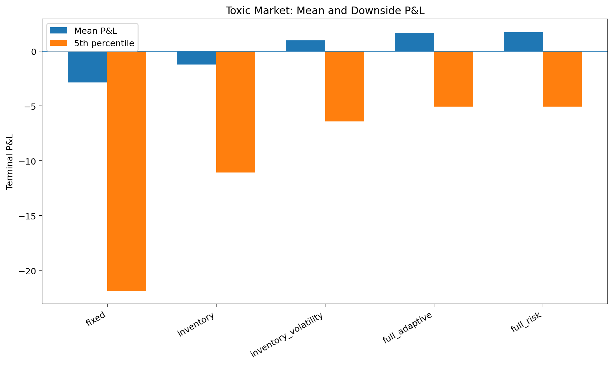
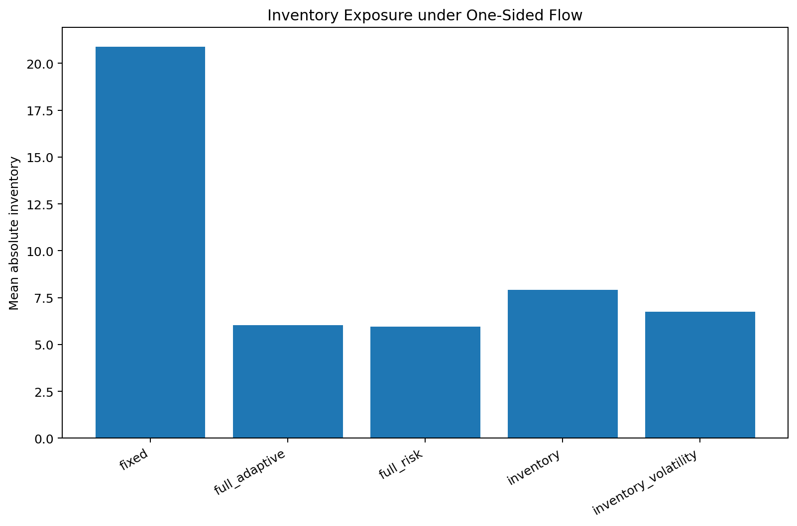
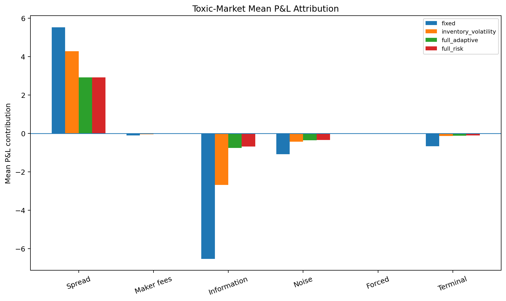
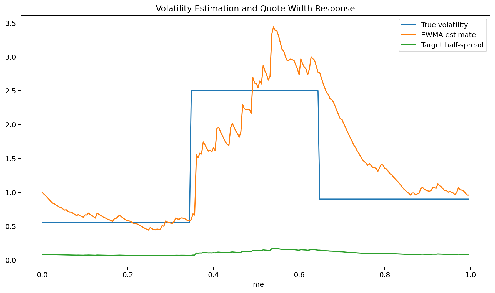
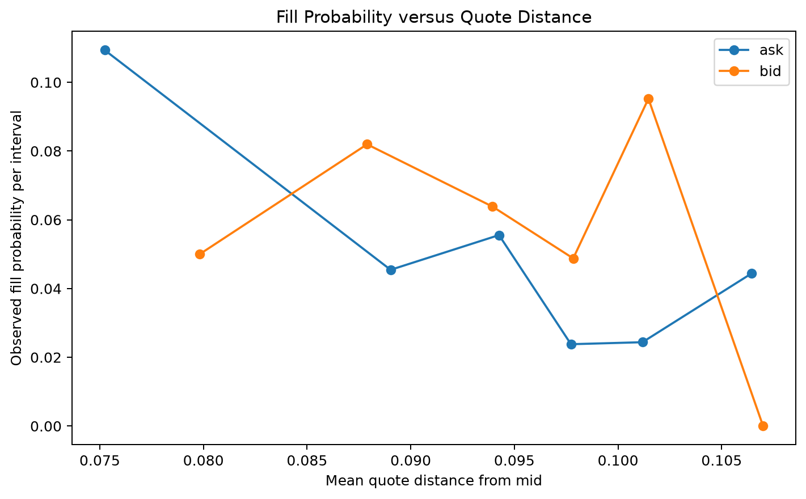
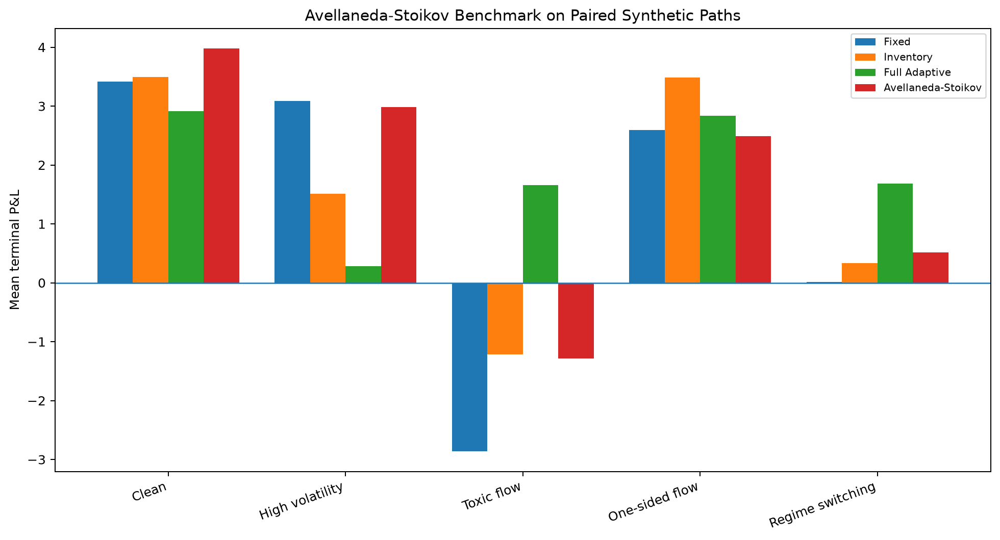
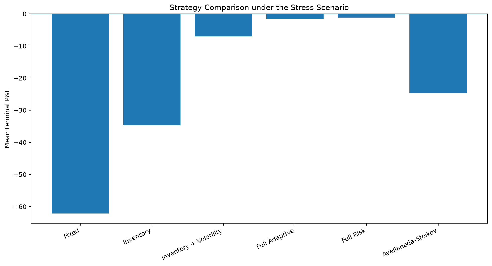

# Inventory-Aware Market-Making Simulator


I kept coming back to a simple contradiction in passive market making: a fill looks profitable at the instant it occurs, yet the position can lose money almost immediately if the market moves against it. I built this simulator to separate those two effects and to see how inventory, volatility, adverse selection, and explicit risk controls interact over the same price path.

The model begins with fixed two-sided quotes. I then add inventory skew, volatility-sensitive width, side-specific markout feedback, and an independent risk layer. I also implemented the finite-horizon Avellaneda–Stoikov model as a separate theoretical benchmark rather than folding it into the original strategy progression.

Cash, inventory, fees, forced execution, terminal liquidation, markouts, and P&L attribution are recorded explicitly because I wanted every terminal result to be traceable back to the ledger rather than explained only by a summary statistic.

> This is a stylized simulator for studying market-making mechanics. It is not a live execution system, a reconstruction of a proprietary strategy, or trading advice.

## Questions that shaped the simulator

1. How much of the quoted spread survives once a filled position is marked to the next mid-price?
2. How quickly can symmetric fills still produce a large inventory position over a finite horizon?
3. Can inventory-dependent skew pull the position back without giving away too much execution edge?
4. How should quote width respond when volatility changes faster than the estimator?
5. What does adverse selection look like in post-fill markouts and in the P&L decomposition?
6. Can side-specific markout feedback protect the quote that is being selected against?
7. When do reduce-only states, forced reduction, cooldowns, and halts improve the left tail despite their execution cost?
8. Do the same conclusions remain visible when every strategy is run on identical exogenous market paths?
9. How does a classical Avellaneda–Stoikov policy compare with the simulator's inventory-, volatility-, toxicity-, and risk-aware rules when all strategies face the same synthetic paths?

## What happened in the configured runs

The canonical experiment uses **40 paired paths per strategy and scenario**, six market scenarios, five strategy variants, and 250 intervals per path, giving **1,200 path–strategy records**. I kept this experiment unchanged after adding Avellaneda–Stoikov so that the original results remain directly reproducible.

- In the toxic-flow scenario, fixed quoting had mean terminal P&L of **−2.86** and a 5th-percentile outcome of **−21.86**. The full adaptive strategy produced **+1.66** and **−5.07**, while mean absolute inventory fell from **6.40** to **1.72** units.
- In the stress scenario, fixed quoting averaged **−62.12**, with a 5th percentile of **−284.97**. The full adaptive strategy averaged **−1.67**, and the risk-controlled version averaged **−1.15** with a 5th percentile of **−11.16**. Under the configured limits, the risk-controlled strategy halted on **22.5%** of stress paths.
- Under one-sided flow, inventory-aware quoting reduced mean absolute inventory from **20.88** units for fixed quoting to **7.91** units. The full adaptive strategy reduced it further to **6.03** units.
- In the regime-switching scenario, volatility-aware inventory quoting raised mean P&L from **0.33** for inventory-only quoting to **2.30**, while the 5th percentile improved from **−8.85** to **−4.69**.
- Stronger volatility defence reduced trading volume and inventory exposure and improved downside outcomes, but it did not always maximize average P&L.
- Representative toxic, regime-switching, and stress paths passed quote, inventory, markout, interval-accounting, and terminal-accounting checks. The largest interval reconciliation error was below **3 × 10⁻¹³**, and the largest terminal residual was below **4 × 10⁻¹²**.
- The included test suite now contains **103 passing tests**.











## Avellaneda–Stoikov benchmark

I added the finite-horizon Avellaneda–Stoikov model as a separate benchmark instead of turning it into a sixth member of `DEFAULT_STRATEGIES`.

That distinction is intentional. The original five strategies form a progression built inside this simulator:

```text
fixed
→ inventory
→ inventory + volatility
→ inventory + volatility + markout defence
→ adaptive quoting + independent risk controls
```

Avellaneda–Stoikov comes from a different starting point: an analytical stochastic-control model with exponential utility, Brownian mid-price dynamics, and distance-dependent Poisson order arrivals. Keeping it separate makes the comparison clearer and preserves the original **1,200-record** experiment.

### Reservation price

For mid-price \(S_t\), inventory \(q_t\), risk aversion \(\gamma\), volatility \(\sigma_t\), and remaining horizon \(T-t\), the reservation price is

```math
r_t =
S_t
-
q_t \gamma \sigma_t^2 (T-t)
```

Positive inventory therefore lowers the reservation price, making the strategy less willing to buy and more willing to sell. Negative inventory produces the opposite shift.

### Optimal spread

With exponential fill intensity

```math
\lambda(\delta) = A e^{-k\delta}
```

the implemented finite-horizon half-spread is

```math
h_t =
\frac{1}{2}
\gamma \sigma_t^2 (T-t)
+
\frac{1}{\gamma}
\ln\left(1+\frac{\gamma}{k}\right)
```

and the theoretical quotes are

```math
p_t^{bid} = r_t - h_t
```

```math
p_t^{ask} = r_t + h_t
```

The simulator already uses the same exponential distance-to-fill structure, so the A–S parameter \(k\) maps directly to the market model's `distance_sensitivity`.

For the benchmark I use:

```text
gamma = 0.003
k     = 18.0
T     = 1.0
```

`k = 18` is the same default distance sensitivity used by the synthetic fill model. `gamma = 0.003` was chosen as a transparent benchmark rather than tuned for P&L: with volatility equal to 1 and the full horizon remaining, the reservation-price shift is approximately `0.003 × inventory`, making its inventory pressure comparable in scale with the existing inventory-skew coefficient.

### Passive-quote constraint

The analytical A–S solution can place one side of the theoretical quote through the current mid-price when inventory pressure becomes sufficiently large.

That would not be consistent with this simulator's passive-fill semantics. The implementation therefore calculates the theoretical reservation price and spread first, then constrains each quote to remain passive and within the configured quote-distance bounds before tick rounding.

The diagnostics retain both the theoretical quantities and indicators showing whether either side was clipped:

```text
reservation_price
target_half_spread
time_to_horizon
as_bid_distance
as_ask_distance
as_bid_clipped
as_ask_clipped
```

This makes the execution constraint explicit rather than silently treating a marketable quote as a passive order.

## A–S benchmark results

The benchmark uses the same six scenarios, the same **40 path IDs per scenario**, the same seeds beginning at `50000`, and the same **250 intervals per path** as the canonical experiment. This adds **240 Avellaneda–Stoikov path records** without changing the original 1,200 records.

Mean A–S terminal P&L in the configured runs was:

| Scenario | Mean P&L | 5th percentile | Mean absolute inventory |
|---|---:|---:|---:|
| Clean | +3.98 | −0.80 | 3.04 |
| High volatility | +2.98 | −4.03 | 1.58 |
| Toxic flow | −1.29 | −10.02 | 2.55 |
| One-sided flow | +2.49 | −18.58 | 11.32 |
| Regime switching | +0.52 | −8.64 | 2.59 |
| Stress | −24.69 | −63.99 | 3.43 |

The pattern matters more than any single ranking.

In the high-volatility scenario, A–S had a paired mean advantage of **+2.71** over `full_adaptive`, with a bootstrap interval of **[+0.49, +5.05]**, and **+3.39** over `full_risk`, with an interval of **[+1.11, +5.66]**.

Under toxic flow, the relationship reversed. A–S trailed `inventory_volatility` by **−2.27** with interval **[−4.33, −0.10]**, `full_adaptive` by **−2.94** with interval **[−4.74, −1.21]**, and `full_risk` by **−3.03** with interval **[−4.80, −1.35]**.

The stress scenario shows a similar distinction between inventory control and broader defensive mechanisms. A–S improved substantially on `fixed` quoting by **+37.43** and on `inventory` quoting by **+10.02**, but it trailed `inventory_volatility` by **−17.63**, `full_adaptive` by **−23.02**, and `full_risk` by **−23.54** on the paired paths.

These are synthetic benchmark results, not claims that one strategy would dominate in live markets. They show that the classical A–S inventory-risk mechanism can be effective under some conditions while explicit volatility adaptation, adverse-selection defence, and hard risk controls become important under others.





The full paired results are saved in:

```text
outputs/tables/avellaneda_stoikov_paired_comparisons.csv
```

`probability_positive` in that table is the fraction of bootstrap resamples in which the paired mean difference is positive. I do not interpret it as a Bayesian posterior probability or as a p-value.

## Additional research notes

- [`docs/results_summary.md`](docs/results_summary.md) summarizes the main numerical findings and how to interpret them.
- [`docs/future_work.md`](docs/future_work.md) lists natural extensions, including empirical calibration against trade-and-quote data.
- [`notebooks/09_parameter_calibration_and_model_assumptions.ipynb`](notebooks/09_parameter_calibration_and_model_assumptions.ipynb) examines how the simulator's fill-rate and markout assumptions can be inspected from path-level data.

## How I separated the moving parts

The implementation keeps four responsibilities apart:

1. **Market model** — generates latent information, quote-dependent order arrivals, volatility regimes, independent noise, and jumps.
2. **Quoting rule** — chooses bid, ask, and displayed size from inventory, estimated volatility, and observed markouts.
3. **Risk manager** — caps size, disables one side, forces inventory reduction, enters cooldown, or halts trading without rewriting the quote logic.
4. **Ledger and attribution** — updates cash and inventory and reconciles each P&L component.

The interval event order is:

```text
observe state → update estimators → propose quote → risk override
→ forced action if required → passive fills → price update
→ mark wealth → update toxicity estimator → record diagnostics
```

I fixed the order because changing it can create look-ahead bias or move costs between accounting periods.

## Strategy variants

The canonical experiment uses these five strategies:

| Strategy | Inventory skew | Volatility width | Markout defence | Hard risk overlay |
|---|---:|---:|---:|---:|
| `fixed` | No | No | No | No |
| `inventory` | Yes | No | No | No |
| `inventory_volatility` | Yes | Yes | No | No |
| `full_adaptive` | Yes | Yes | Yes | No |
| `full_risk` | Yes | Yes | Yes | Yes |

The additional `avellaneda_stoikov` implementation is a theoretical benchmark and is intentionally not included in `DEFAULT_STRATEGIES`.

## P&L accounting

For each interval, the change in marked-to-market wealth is decomposed into forced-execution P&L, passive spread capture, maker fees, and inventory markout:

```math
\Delta W_t =
\Pi_t^{\text{forced}}
+
\Pi_t^{\text{passive spread}}
-
C_t^{\text{maker fees}}
+
q_t \Delta m_t
```

In scenarios with coupled toxic flow, price P&L is further separated into drift, information, independent noise, and jump components. Terminal liquidation is recorded as its own final wealth adjustment.

## Files

```text
.
├── config/experiments.yaml
├── docs/
├── notebooks/                         # Nine executed notebooks
├── outputs/
│   ├── data/                          # Canonical and A-S path results
│   ├── figures/                       # Canonical, calibration, and benchmark figures
│   └── tables/                        # Strategy, attribution, robustness, validation, and A-S tables
├── scripts/run_all_experiments.py
├── src/market_maker_lab/
│   ├── avellaneda_stoikov.py          # Finite-horizon A-S benchmark
│   └── ...                            # Simulator and analysis modules
├── tests/                             # 103 automated tests
├── pyproject.toml
└── requirements.txt
```

## Run it locally

```bash
python -m venv .venv
source .venv/bin/activate  # Windows: .venv\Scripts\activate
python -m pip install --upgrade pip
python -m pip install -e ".[dev]"
pytest
python scripts/run_all_experiments.py
```

The experiment script recreates the canonical tables, A–S benchmark tables, representative path data, validation records, and generated figures with fixed seeds.

## Small example

```python
from market_maker_lab.monte_carlo import run_path
from market_maker_lab.strategy_factory import DEFAULT_STRATEGIES

result = run_path(
    scenario="toxic",
    spec=DEFAULT_STRATEGIES[3],
    seed=50_123,
    steps=250,
)

print(result.terminal_pnl)
print(result.intervals[[
    "inventory_after_fills",
    "spread_capture",
    "information_price_pnl",
    "reconciliation_error",
]].tail())
```

An Avellaneda–Stoikov path can be built explicitly:

```python
from market_maker_lab.monte_carlo import run_path
from market_maker_lab.strategy_factory import StrategySpec

spec = StrategySpec(
    "avellaneda_stoikov",
    risk_aversion=0.003,
    distance_sensitivity=18.0,
)

result = run_path(
    scenario="high_volatility",
    spec=spec,
    seed=50_123,
    steps=250,
)

print(result.terminal_pnl)
print(result.intervals[[
    "reservation_price",
    "target_half_spread",
    "as_bid_clipped",
    "as_ask_clipped",
]].tail())
```

## Notebook sequence

1. `01_market_microstructure.ipynb` — bid, ask, inventory, spread capture, and markouts
2. `02_event_driven_simulator.ipynb` — event ordering, state tables, and accounting
3. `03_fixed_spread_baseline.ipynb` — quote width and fill-rate trade-off
4. `04_inventory_aware_quoting.ipynb` — inventory feedback and position control
5. `05_volatility_aware_spreads.ipynb` — EWMA volatility and dynamic width
6. `06_adverse_selection.ipynb` — toxic flow and multi-horizon markouts
7. `07_risk_controls.ipynb` — reduce-only, forced execution, cooldown, and halt states
8. `08_full_evaluation_and_pnl_attribution.ipynb` — paired paths and exact attribution
9. `09_parameter_calibration_and_model_assumptions.ipynb` — fill-rate, markout, and model-assumption checks

## How I checked the implementation

The tests and validation records cover:

- quote positivity, non-crossing, and tick rounding;
- buy/sell sign conventions;
- cash and inventory updates;
- spread-plus-price markout identities;
- estimator resets between paths;
- signal-dependent toxic-flow direction;
- identical exogenous price paths across paired strategies;
- inventory-size capacity and hard-limit enforcement;
- risk-state transitions and persistent halts;
- forced-execution spread, fee, and impact costs;
- information, noise, drift, and jump decomposition;
- new-fill and carried-inventory decomposition;
- interval and terminal P&L reconciliation;
- A–S reservation-price direction under positive and negative inventory;
- A–S finite-horizon spread calculation;
- horizon convergence;
- passive-quote clipping;
- inventory-limit size handling;
- factory construction and simulator integration;
- preservation of the original five-member `DEFAULT_STRATEGIES`.

## Where the model stops

The simulator does not include a full limit-order book, queue position, exchange latency, order priority, hidden liquidity, empirically calibrated market impact, funding and margin, cross-asset hedging, or venue-specific fees.

The toxic-flow process is deliberately stylized so that adverse selection can be isolated and traced through the accounting. The Avellaneda–Stoikov comparison is likewise a benchmark inside this synthetic environment; its parameters have not been estimated from a live venue's order-arrival process.

See [`docs/limitations.md`](docs/limitations.md) for the full scope statement and [`docs/technical_notes.md`](docs/technical_notes.md) for the questions I used when reading the outputs.

## License

MIT License. See [`LICENSE`](LICENSE).
